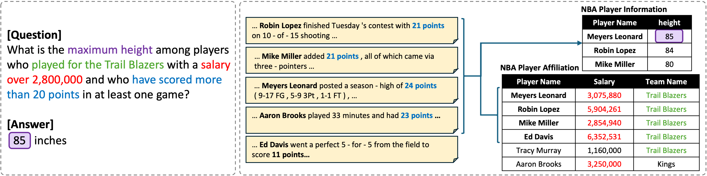

<!-- Improved compatibility of back to top link: See: https://github.com/othneildrew/Best-README-Template/pull/73 -->
<a name="readme-top"></a>
<!--
*** Thanks for checking out the Best-README-Template. If you have a suggestion
*** that would make this better, please fork the repo and create a pull request
*** or simply open an issue with the tag "enhancement".
*** Don't forget to give the project a star!
*** Thanks again! Now go create something AMAZING! :D


<!-- PROJECT SHIELDS -->
<!--
*** I'm using markdown "reference style" links for readability.
*** Reference links are enclosed in brackets [ ] instead of parentheses ( ).
*** See the bottom of this document for the declaration of the reference variables
*** for contributors-url, forks-url, etc. This is an optional, concise syntax you may use.
*** https://www.markdownguide.org/basic-syntax/#reference-style-links
-->
<!-- [![Contributors][contributors-shield]][contributors-url] -->
<!-- [![Forks][forks-shield]][forks-url] -->
<!-- [![Stargazers][stars-shield]][stars-url] -->
<!-- [![Issues][issues-shield]][issues-url] -->
<!-- [![MIT License][license-shield]][license-url] -->
<!-- [![LinkedIn][linkedin-shield]][linkedin-url] -->


<!-- PROJECT LOGO -->
<br />
<div align="center">
  <!-- <a href="https://github.com/github_username/repo_name">
    
  </a> -->

<h3 align = "center">SPARTA: Scalable and Principled Benchmark of Tree-Structured Multi-hop QA over Text and Tables</h3>

  <p align = "center">
    SPARTA is a large-scale Table-Text QA benchmark automatically generated by an end-to-end construction framework.
    <!-- <br />
    <a href="https://github.com/github_username/repo_name"><strong>Explore the docs »</strong></a>
    <br />
    <br />
    <a href="https://github.com/github_username/repo_name">View Demo</a>
    ·
    <a href="https://github.com/github_username/repo_name/issues">Report Bug</a>
    ·
    <a href="https://github.com/github_username/repo_name/issues">Request Feature</a> -->
  </p>
</div>


<!-- ABOUT THE PROJECT -->
## About SPARTA

SPARTA is a large-scale Table–Text QA benchmark designed to rigorously evaluate deep, multi-hop reasoning across heterogeneous data sources. SPARTA provides a thousand high-fidelity instances featuring complex operations such as aggregation, grouping, and tree-structured multi-hop inference over both structured tables and unstructured texts. It enables comprehensive testing of QA models on tasks that closely mirror real-world analytical queries, which are underrepresented in prior datasets. In contrast to existing benchmarks where multi-hop questions are typically limited to simplistic linear chains, SPARTA includes a diverse array of reasoning patterns such as multi-branch paths, longer inference chains, and uni-modality hops (e.g., multiple steps within either text or table alone). These enriched reasoning structures are critical for assessing model performance on complex, real-world inference tasks.

<p align = "center">

</p>

## Task Details

- **Task Type**: Table-Text QA

- **Question Type**

    SPARTA supports a broad spectrum of reasoning types and SQL operations that reflect real-world analytical tasks:

    - **SQL Operators**:
        - `WHERE` (100%)
        - `AGGREGATION` (50.0%)
        - `GROUP BY` (12.6%)
        - `HAVING` (3.4%)
        - `ORDER BY` (6.2%)
        - `LIMIT` (4.4%)

    - **Query Shapes**:
        - **Non-nested** (50%)
        - **Star-shaped joins** of size 1–3 (30%)
        - **Chain-structured joins** of size 2–3 (20%)

    - **Reasoning Modalities**:
        - **Cross-modal multi-hop**: combining evidence from both table and text
        - **Uni-modal multi-hop**: multi-hop reasoning confined within either table or text

    This coverage allows SPARTA to evaluate not only **deep logical inference** and **advanced SQL operations**, but also the model's ability to navigate both **cross-modal** and **uni-modal** reasoning paths—unlike many existing benchmarks which support only shallow or cross-modal chains.

- **Answer Format**

    The answer is represented as a **list of values**, which may include:
    - **Text spans** (e.g., `"Jalen Rose"`, `"Celtics"`)
    - **Numeric values** (e.g., `4`, `10.23`)
    - **Date values** (eg., `"2014-12-27"`)
    
    The list may contain:
    - A **single answer** (e.g., `["Jalen Rose"]`, `[24.4]`)
    - **Multiple answers** (e.g., `["Celtics", "Trail Blazers"]` or `[4, 3, 10]`), typically in the case of aggregation, grouping, or set-returning queries
    
    All answers are extracted directly from the **SQL execution result**, ensuring consistency with the underlying data.

- **Evaluation Metrics**: 
    - *Exact Match (EM)*  
    - *F1 Score*  
    - *Precision*
    - *Recall*

## Dataset Structure

Each sample in the dataset is represented as a JSON object with the following fields:
```json
{
    "question_id": 624,
    "question": "Which team scored the highest points in the arena with the highest capacity among the teams that were founded before 1970 and have an arena capacity of more than 18000, and also scored more than 160 points, and is either the Bulls or the Lakers?",
    "table": [
        "nba_team_information",
        "nba_team_game_stats"
    ],
    "sql_query": "SELECT team_name FROM nba_team_game_stats WHERE team_points >= (SELECT MAX(team_points) AS max_points_scored FROM nba_team_game_stats WHERE team_name IN (SELECT team_name FROM nba_team_information WHERE arena_capacity >= (SELECT MAX(arena_capacity) AS max_arena_capacity FROM nba_team_information WHERE arena_capacity > 18000 AND founded_year < 1970))) AND team_points > 160 AND team_name IN ('Bulls', 'Lakers')\n",
    "answer": [
        "Bulls"
    ]
},
```
- `question`: A natural language question.
- `table`: A list of gold tables used to answer the question.
- `sql_query`: The corresponding SQL query that retrieves the answer from the tables.
- `answer`: The answer(s) to the question.


## Benchmark Statistics

| # Questions| Avg. Table Rows | Avg. Table Columns |
|------------|-----------------|--------------------|
| 1,000      | 3280.5          | 12.2               |


## Getting Started

This page guides you to reproduce the results written in the paper "SPARTA: Scalable and Principled Benchmark of Tree-Structured Multi-hop QA over Text and Tables".

Please refer to the instructions below.

### Prerequisites


You must be able to download our docker image from the docker cloud.
Please refer to [Docker Docs](https://docs.docker.com) to download docker.

### Downloading Anonymized Files

Please download the following files from the anonymized **sparta_anonymous** project hosted on the Open Science Framework (OSF):

- `corpus.zip`
- `Dataset.zip`
- `Workload.zip`
- `embedding_cache.zip`

The files are available in the "Files" section of the anonymized project at the following link:  
[https://osf.io/3abrs/?view_only=7829111feb524fd597c3cada22f8e4ad](https://osf.io/3abrs/?view_only=7829111feb524fd597c3cada22f8e4ad)

---

### Extracting and Organizing Files

1. `corpus.zip`

Unzip the file and move the extracted `corpus` folder to the following directory:  
`SPARTA/Benchmark/RFDatabaseConstruction/docker-entrypoint-initdb.d/`

    ```bash
    unzip corpus.zip
    mv corpus SPARTA/Benchmark/RFDatabaseConstruction/docker-entrypoint-initdb.d/corpus
    ```
2. `embedding_cache.zip`

Unzip the file and move the extracted embedding_cache folder to the following directory:
`SPARTA/Baseline/ODYSSEY/`

You can use the following commands:

    ```bash
    unzip embedding_cache.zip
    mv embedding_cache SPARTA/Baseline/ODYSSEY/embedding_cache
    ```

3. `Dataset.zip` and `Workload.zip`

Unzip both files and move the extracted folders to:
`SPARTA/Benchmark/`

You can use the following commands:

    ```bash
    unzip Dataset.zip
    unzip Workload.zip
    mv Dataset SPARTA/Benchmark/Dataset
    mv Workload SPARTA/Benchmark/Workload
    ```

### Download & Run the Large Langiage Model

1. Download the large language model
    ```bash
    HF_HUB_ENABLE_HF_TRANSFER=1 huggingface-cli download meta-llama/Llama-3.1-70B-Instruct --local-dir-use-symlinks False --local-dir /mnt/Meta-Llama-3.1-70B-Instruct --exclude *.pth
    ```

2. Run the large language model
    ```bash
    docker run --gpus all \
        -p 30000:30000 \
        --ipc=host \
        --mount type=bind,source=/mnt,target=/root \
        lmsysorg/sglang:latest \
        python3 -m sglang.launch_server --model-path /root/Llama-3.1-70B-Instruct --host 0.0.0.0 --port 30000 --tp 4
    ```

### Setup Docker Containers

    ```bash
    cd SPARTA
    docker compose up -d
    ```

### Reference Fact Database Construction
    ```bash
    python Benchmark/RFDatabaseConstruction/construct.py
    ```

### Activate Conda Env
    ```bash
    docker exec -it sparta_workspace bash
    conda activate sparta
    ```

### Query Generation

1. Leaf Nodes Generation
    ```bash
    cd sparta
    export PYTHONPATH=Benchmark/QueryGeneration
    export PYTHONPATH=Benchmark/QueryGeneration/methods
    # one-shot
    python Benchmark/QueryGeneration/non_nested_query_generation.py approach_name=oneshot
    # clause-by-clause
    python Benchmark/QueryGeneration/non_nested_query_generation.py approach_name=cbc
    # execution-guided
    python Benchmark/QueryGeneration/non_nested_query_generation.py approach_name=eg
    ```

2. Non-leaf Nodes Generation
    ```bash
    # one-shot-k
    python Benchmark/QueryGeneration/nested_query_generation.py approach_name=oneshotk
    # post-order w/o provenance
    python Benchmark/QueryGeneration/nested_query_generation.py approach_name=postorder is_prov=False
    # post-order w/ provenance
    python Benchmark/QueryGeneration/nested_query_generation.py approach_name=postorder is_prov=True
    ```

### Question Verbalization
    ```bash
    python Benchmark/QuestionVerbalisation/assemble.py
    python Benchmark/QuestionVerbalisation/translate.py
    ```

### Table-Text Question Answering
    ```bash
    sh Baseline/ODYSSEY/script/preprocess.sh
    python Baseline/ODYSSEY/inference.py
    ```

## Baseline Models

| Model                    | EM       | F1       | Precision (P) | Recall (R) |
| ------------------------ | -------- | -------- | ------------- | ---------- |
| ODYSSEY w/ GPT-4.1       | 12.7     | **20.5** | **30.5**      | **20.9**   |
| ODYSSEY w/ GPT-3.5-turbo | 8.8      | 15.5     | 27.2          | 16.2       |
| HProPro w/ GPT-4.1       | **18.5** | 20.1     | 21.1          | 20.6       |
| HProPro w/ GPT-3.5-turbo | 13.5     | 16.3     | 19.0          | 17.1       |


## Languages

The dataset is in English language.