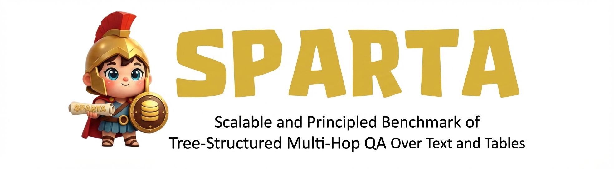

# SPARTA: Scalable and Principled Benchmark of Tree-Structured Multi-hop QA over Text and Tables

<p align="center">
    
</p>

<p align="center">
  <a href="https://openreview.net/pdf?id=8KE9qvKhM4"></a>
  <a href="https://sparta-projectpage.github.io/"></a>
  <a href="https://huggingface.co/datasets/pshlego/SPARTA"></a>
  
</p>

<p align="center">
  <a href="https://openreview.net/pdf?id=8KE9qvKhM4">Paper</a> · <a href="https://sparta-projectpage.github.io/">Project Page</a> · <a href="https://huggingface.co/datasets/pshlego/SPARTA">Dataset</a>
</p>

## About SPARTA

SPARTA is a large-scale Table-Text QA benchmark automatically generated by an end-to-end construction framework with lightweight human validation, rather than being manually curated with extensive human annotation.

SPARTA is designed to rigorously evaluate deep, multi-hop reasoning across heterogeneous data sources. It provides thousands of high-fidelity instances featuring complex operations such as aggregation, grouping, and tree-structured multi-hop inference over both structured tables and unstructured texts.

Unlike existing benchmarks where multi-hop questions are typically limited to simplistic linear chains, SPARTA includes:
- Multi-branch paths (star-shaped joins)
- Longer inference chains (up to 3+ hops)
- Uni-modal hops (multiple steps within either text or table alone)
- Cross-modal multi-hop reasoning

These enriched reasoning structures are critical for assessing model performance on complex, real-world inference tasks.
<p align = "center">

</p>

## Dataset Structure

Each sample is represented as a JSON object with the following fields:
```json
  {
    "is_nested": true,
    "is_aggregated": false,
    "height": 1,
    "breadth": {
      "1": 2
    },
    "max_breadth": 2,
    "type": "nested (height=1, max_breadth=2)",
    "clause_usage": {
      "WHERE": true,
      "GROUP BY": true,
      "HAVING": false,
      "ORDER BY": false,
      "LIMIT": false
    },
    "aggregate_usage": {
      "SUM": false,
      "COUNT": false,
      "MAX": false,
      "MIN": false,
      "AVG": false
    },
    "question_id": "nba:3",
    "source_file": "/root/TextDBQA/corrected_workload/Validation_of_SPARTA_-_NBA_fixed_w_hg.csv",
    "question": "What are the years of birth of the players who have a lane agility time of more than 11.5 seconds, a three quarter sprint of less than 3.35 seconds, more than 10 field goals made and more than 8 rebounds in a game?",
    "sql_query": "SELECT birthyear FROM nba_player_information WHERE player_name IN (SELECT player_name FROM nba_draft_combine_stats WHERE lane_agility_time > 11.5 AND three_quarter_sprint < 3.35) AND player_name IN (SELECT player_name FROM nba_player_game_stats WHERE number_of_field_goals_made > 10 AND number_of_rebound > 8) GROUP BY birthyear",
    "answer": [
      "1984",
      "1985",
      "1989",
      "1990",
      "1997"
    ],
    "table": [
      "nba_draft_combine_stats",
      "nba_player_game_stats",
      "nba_player_information"
    ]
  },
```

## Benchmark Statistics

### Coverage across Multiple Domains

| Domain | # Questions | Avg. Table Rows | Avg. Table Columns |
|--------|------------|-----------------|-------------------|
| NBA    | 1,130      | 3,280.5        | 12.2              |
| Movie  | 1,130      | 10,054.0       | 4.7               |
| Medical| 1,130      | 200.0          | 6.7               |

## Getting Started

### Prerequisites


Docker must be installed to run the benchmark. Please refer to [Docker Docs](https://docs.docker.com) for installation instructions.

### Downloading Files

Download the following files from the anonymized **sparta_anonymous** project on OSF:
- `Corpus_SPARTA.zip`
- `Dataset_SPARTA.zip`

Available at: [https://osf.io/3abrs/overview?view_only=63517e22849a47c9a6a2696fd740fdfc](https://osf.io/3abrs/overview?view_only=63517e22849a47c9a6a2696fd740fdfc)

### Extracting and Organizing Files

1. **Corpus_SPARTA.zip**
```bash
unzip Corpus_SPARTA.zip
mv Corpus_SPARTA ./data/corpus
```

2. **Dataset_SPARTA.zip**
```bash
unzip Dataset_SPARTA.zip
mv Dataset_SPARTA ./data/docker-entrypoint-initdb.d
```

### Download & Run Large Language Model

1. Download Llama 3.1 70B model:
```bash
HF_HUB_ENABLE_HF_TRANSFER=1 huggingface-cli download meta-llama/Llama-3.1-70B-Instruct --local-dir-use-symlinks False --local-dir /mnt/Meta-Llama-3.1-70B-Instruct --exclude *.pth
```

2. Run the model server:
```bash
docker run --gpus all \
    -p 30000:30000 \
    --ipc=host \
    --mount type=bind,source=/mnt,target=/root \
    lmsysorg/sglang:latest \
    python3 -m sglang.launch_server --model-path /root/Llama-3.1-70B-Instruct --host 0.0.0.0 --port 30000 --tp 4
```

### Setup Docker Containers
```bash
cd SPARTA
docker compose up -d
```

### Reference Fact Database Construction
```bash
# nba
python src/sparta/RFDatabaseConstruction/nba/construct.py

# medical
python src/sparta/RFDatabaseConstruction/medical/construct.py sparta/db=medical

# movie
python src/sparta/RFDatabaseConstruction/imdb/construct.py sparta/db=imdb
```

### Activate Conda Environment
```bash
docker exec -it textdbqa_workspace bash
conda activate sparta
```

### Query Generation

1. **Leaf Nodes Generation**
```bash
export PYTHONPATH=.:src/sparta/QueryGeneration:src/sparta/QueryGeneration/methods

# One-shot
python src/sparta/QueryGeneration/non_nested_query_generation.py sparta.query_generation.approach_name=oneshot

# Clause-by-clause
python src/sparta/QueryGeneration/non_nested_query_generation.py sparta.query_generation.approach_name=cbc

# Execution-guided
python src/sparta/QueryGeneration/non_nested_query_generation.py sparta.query_generation.approach_name=eg
```

2. **Non-leaf Nodes Generation**
```bash
# One-shot-k
python src/sparta/QueryGeneration/nested_query_generation.py sparta/query_generation=nested sparta.query_generation.approach_name=oneshotk

# Post-order w/o provenance
python src/sparta/QueryGeneration/nested_query_generation.py sparta/query_generation=nested sparta.query_generation.approach_name=postorder sparta.query_generation.is_prov=False

# Post-order w/ provenance
python src/sparta/QueryGeneration/nested_query_generation.py sparta/query_generation=nested sparta.query_generation.approach_name=postorder sparta.query_generation.is_prov=True
```

## Leaderboard Submission

If you want to submit your results to the SPARTA leaderboard, please refer to the [Submission Guidelines](sparta_submission_guideline.md) for detailed instructions.

## Languages

The dataset is in English language.